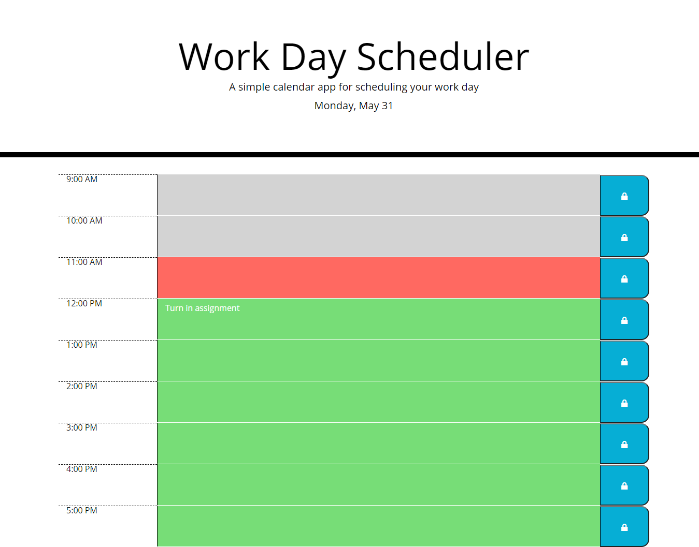

# Scheduler

## Purpose

To build a day planner that updates as the hours progress and saves data to localstorage.

## Built with

- HTML
- CSS
- Javascript
- JQuery
- Bootstrap
- Moment.js

## Website

https://quasse.github.io/scheduler/

## Screenshot

## Contribution

Made by Sam Morgen
